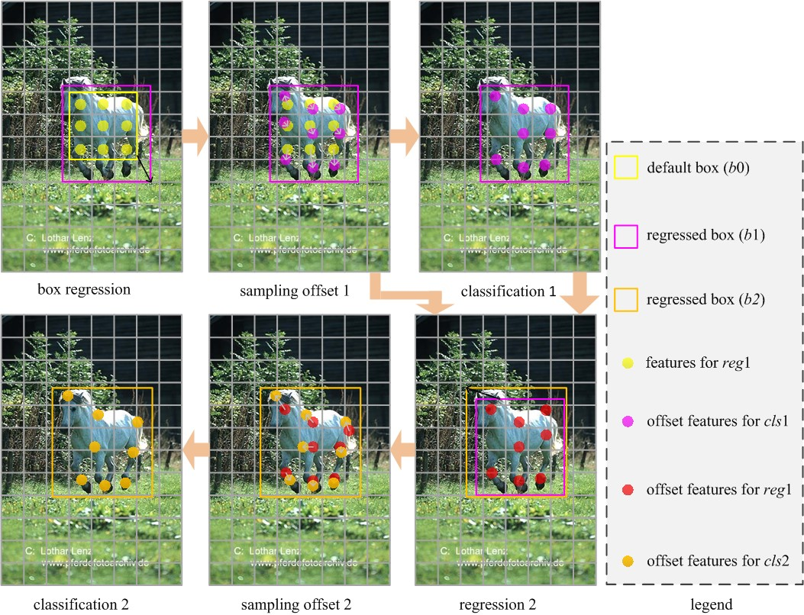

# HSD

This code is a official implementation of "Hierarchical Shot Detector (ICCV2019)" on COCO object detection with Pytorch. 

## Introduction
We propose a novel pipeline for accurate object detection (called ROC). Instead of simultaneous classification and regression, ROC firstly conducts box regression, secondly predicts the feature sampling locations for box classification, and finally classifies regressed boxes with the features of offset locations. To achieve the better detection accuracy, a hierarchical shot detector is proposed by stacking two ROC modules. Meanwhile, the contextual information is also incorporated to enrich the features of the second ROC module.

<div align="center">
  
  <p>HSD detection pipeline.</p>
</div>

## Results
|    name     |  backbone  | input size | minival | download |
| :-------------: | :-----: | :-----: | :------: | :-----------------: |
|     HSD320     |  VGG16  |   320x320    |    33.9     |          [model](https://drive.google.com/open?id=1SQ3PIdc9WD_Dj4X9MHhqeX9nq5aZ9r9e)         |
|     HSD512     |  VGG16  |   512x512    |    38.6      |       [model](https://drive.google.com/open?id=1Jvpv5Exhtsnbo8XXcJwc0mACYfGugjav)         |
|     HSD512     |  ResNet101  |   512x512    |    39.7    |        [model](https://drive.google.com/open?id=1FmOwuat0yfqu_B499O95_EbNAJnbHzgH)         |
|     HSD512     |  ResNext101  |   512x512    |    41.4    |          model         |

## Installation
- Install PyTorch-0.4.0 and Python 3+.
- Clone this repository.
- Compile the nms and install coco tools:
```shell
cd HSD
pip install Cython, pycocotools, opencv-python, matplotlib, PyYaml
./make.sh
```
- Compile the deformable convolution:
```shell
cd HSD/models/deform
sh make.sh
CC=g++ python build.py
```
- Then download the COCO dataset and put the MS COCO dataset at $path/data/coco
```
coco
|_ images
|  |_ train2014
|     |_ <imgname>.jpg
|     |_ ...
|  |_ val2014
|     |_ ...
|  |_ test2015
|     |_ ...
|_ annotations
|  |_ instances_train2014.json
|  |_ ...
|_ cache
```
## Train and Inference
- Download the pre-trained models (e.g., VGG16, Resnet, and ResNext) and put these models in the `HSD/weights/pretrained_models/` dir:
```Shell
VGG16:      wget https://s3.amazonaws.com/amdegroot-models/vgg16_reducedfc.pth
ResNet101:  wget https://download.pytorch.org/models/resnet101-5d3b4d8f.pth
Resnext101: wget https://s3.ap-northeast-2.amazonaws.com/open-mmlab/pretrain/third_party/resnext101_32x4d-a5af3160.pth
```
- Use `train.py` to train the detector:
```Shell
e.g., python train.py --cfg ./configs/hsd_vgg_coco_320.yaml
```
- To evaluate a trained network:

```Shell
e.g., python eval.py --cfg ./configs/hsd_vgg_coco_320.yaml --weights ./weights/hsd-vgg320-coco/hsd_vgg_epoch_160_300.pth
```

## Ciatation
If the project helps your research, please cite this paper.

```
@misc{Cao_HSD_ICCV_2019,
  author =       {Jiale Cao and Yanwei Pang and Jungong Han and Xuelong Li},
  title =        {Hierarchical Shot Detector},
  journal =      {Proc. International Conference on Computer Vision},
  year =         {2019}
}
```
## Acknowledgement
Many thanks to the open source codes, i.e., [SSD_Pytorch](https://github.com/yqyao/SSD_Pytorch), [deformable-convolution-pytorch](https://github.com/1zb/deformable-convolution-pytorch), [mmdetection](https://github.com/open-mmlab/mmdetection), and [DANet](https://github.com/junfu1115/DANet).

